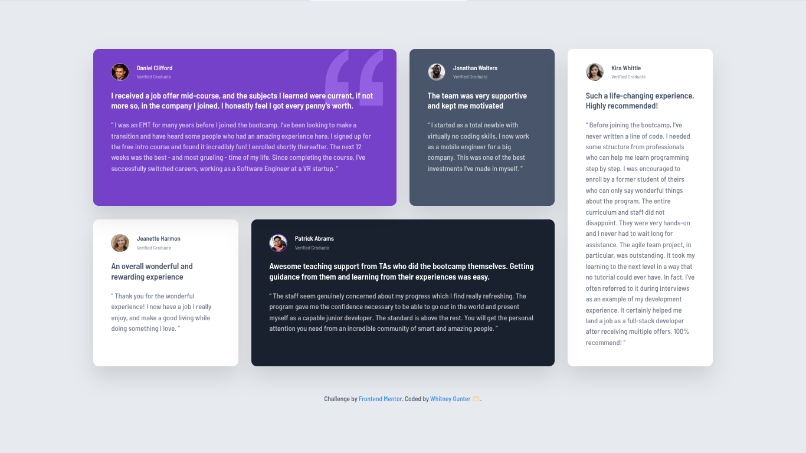
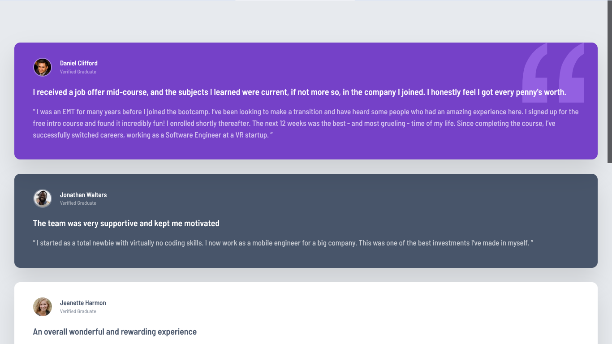
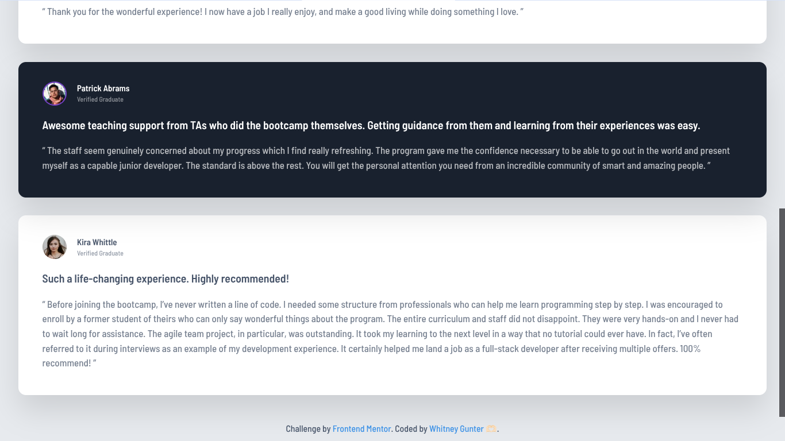

# Frontend Mentor - Testimonials grid section solution

This is a solution to the [Testimonials grid section challenge on Frontend Mentor](https://www.frontendmentor.io/challenges/testimonials-grid-section-Nnw6J7Un7). Frontend Mentor challenges help you improve your coding skills by building realistic projects.

## Table of contents

- [Overview](#overview)
  - [The challenge](#the-challenge)
  - [Screenshot](#screenshot)
  - [Links](#links)
- [My process](#my-process)
  - [Built with](#built-with)
  - [What I learned](#what-i-learned)
  - [Continued development](#continued-development)
  - [Useful resources](#useful-resources)
- [Author](#author)

## Overview

### The challenge

Users should be able to:

- View the optimal layout for the site depending on their device's screen size
- Experience a clean and balanced grid layout on desktop
- See a fully stacked layout on mobile

This project required careful attention to spacing, typography, layering, and grid placement to accurately match the design files.

### Screenshot

- Testimonials Grid Section &mdash; Desktop Layout:



- Testimonials Grid Section &mdash; Mobile Layout (Stacked):





### Links

- Solution URL: [GitHub Solution URL](https://github.com/whitgunt77/testimonials-grid-challenge)
- Live Site URL: [Live Site URL](https://whitgunt77.github.io/testimonials-grid-challenge/)

## My process

### Built with

- Semantic HTML5 markup
- CSS custom properties (variables)
- Flexbox (for internal card alignment)
- CSS Grid (primary layout system)
- Mobile-first workflow
- Responsive design using media queries
- Google Fonts (Barlow Semi Condensed)

### What I learned

This project significantly strengthened my understanding of CSS Grid and how powerful `grid-template-areas` can be for complex layouts.

One key takeaway was structuring the grid for mobile first, then redefining it at larger breakpoints:

```css
.testimonials {
  display: grid;
  grid-template-areas:
    "daniel"
    "jonathan"
    "jeanette"
    "patrick"
    "kira";
}
```

Then redefining it for desktop:

```css
@media (min-width: 1100px) {
  .testimonials {
    grid-template-columns: repeat(4, 1fr);
    grid-template-areas:
      "daniel daniel jonathan kira"
      "jeanette patrick patrick kira";
  }
}
```

I also practiced:

- Managing visual hierarchy using font weights (500 vs 600)
- Creating reusable card styling
- Using `position: relative` and pseudo-elements for background quotation graphics
- Fine-tuning spacing and shadows for visual balance

### Continued development

Going forward, I want to:

- Refine my ability to visually "read" designs and estimate spacing more accurately
- Practice advanced Grid features like implicit grids and auto-placement
- Experiment with CSS clamp() for more fluid typography
- Improve consistency in color contrast and accessibility testing

### Useful resources

- [CSS Grid Complete Guide &mdash; CSS Tricks](https://css-tricks.com/complete-guide-css-grid-layout/) - Helped reinforce grid concepts and layout structuring.
- [MDN Web Docs &mdash; CSS Grid](https://developer.mozilla.org/en-US/docs/Web/CSS/CSS_Grid_Layout) - Great reference for understanding grid-area placement and responsive adjustments.
- [Frontend Mentor Community Solutions](https://www.frontendmentor.io/community) - Helpful for comparing approaches and improving layout accuracy.

## Author

- Author: **Whitneyy Gunter**
- Frontend Mentor - [@whitgunt77](https://www.frontendmentor.io/profile/whitgunt77)
- GitHub - [@whitgunt77](https://github.com/whitgunt77)
